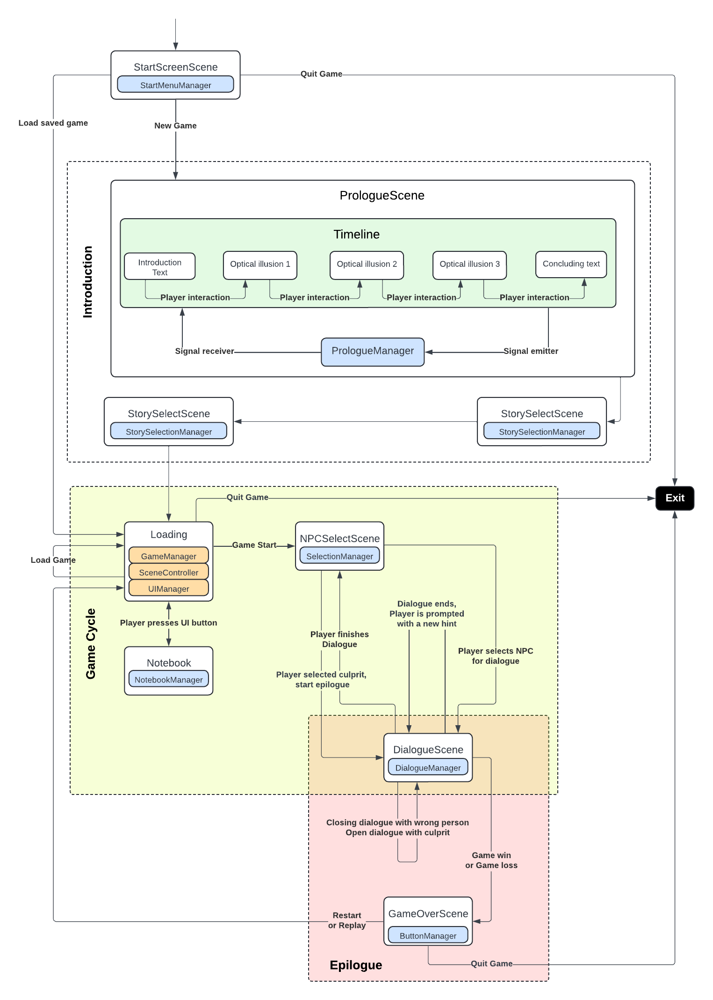
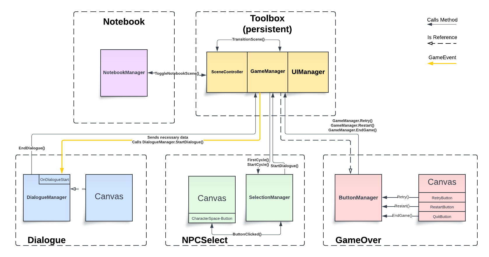

***Open Mind***

**Project Summary**

The Open Mind Game is an educational game in which players have to take on the role of a person who is going to a reunion of a University. 
During the game the player meets multiple characters and learns about these characters. 
The goal of the game is to teach students perspective-taking skills. This goal is achieved by implementing the game in an educational setting. 
Moreover, by using role play and cooperative game mechanics, development of these skills is encouraged. 

**Documentation**

Click [Here](https://siwertdj.github.io/OpenMind/) to read the full documentation.

**Project Description**

The game consists of three major parts: the prologue, the game cycle and the epilogue. 
During the prologue, the player gets acquainted with the theme of the game. 
The player has to do some small tasks in order to become aware of the fact that different people may perceive reality in different ways. 
After the prologue, the actual game starts. The game has a cyclic structure.  
The idea is that something is going on and the player has to find the culprit. This can be done by asking questions. 
A cycle of the game consists of the player asking questions to the characters, then one character disappears from the game and then the player receives a hint about the culprit. 
After a few cycles, the player has to choose who they think the culprit is. 
During the epilogue the player gets to know whether or not they chose correctly and they get to reflect on their choice. 

The characters of this game are based on real people. The game contains 24 characters. 
When the game is started, four characters are randomly selected and one of them is randomly chosen to be the culprit. 
These are the characters that the game will be played with. Each character has its own set of questions and associated answers. 
This means that the player can not create questions, but has to choose between existing ones. 
Also, the questions that can be asked may vary depending on the characters currently in the game. 

**How to install**

The project is made using Unity version 2022.3.45f1. To install and edit the project download/clone the contents of the repository, add it to your unity hub then open it using the proper Unity version.

**Team**

[Siwert](https://github.com/Siwertdj) (Product Owner)

[Denise](https://github.com/deniseadrianapatricia) (Scrum Master)

[Justin](https://github.com/Funnyyjustin) (Chairman)

[Sebas](https://github.com/Seb115)

[Hille](https://github.com/Hilliekopter)

[Vincent](https://github.com/vinsko)

[Iet](https://github.com/Tiny-Dots)

[Joost](https://github.com/JoostKootstra)

[Sander](https://github.com/Aquatic-Trident)

[Ahmet](https://github.com/Shikasi)

Leanne (Artist)

Xerabi (Artist)

**Architecture**

Scene Flow Diagram

System Architecture

